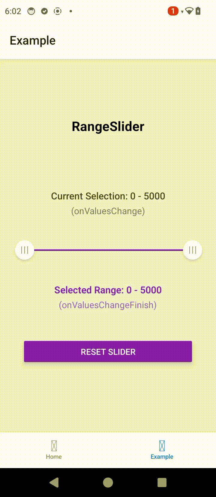

# react-native-range-slider-fast

A high-performance React Native range slider component built with [react-native-reanimated](https://docs.swmansion.com/react-native-reanimated) and [react-native-gesture-handler](https://docs.swmansion.com/react-native-gesture-handler) for smooth animations and precise touch control. **Pure JavaScript implementation - no native code required.**

## Features

- 🚀 High performance using react-native-reanimated
- 🎯 Precise touch controls with react-native-gesture-handler
- 💨 Smooth animations running on UI thread
- 🔄 Real-time value updates
- 🎨 Fully customizable styling
- ♿️ Accessibility support
- 📱 Pure JavaScript implementation - no native code or linking needed
- 🔧 Configurable min/max values and step sizes
- 🎛 Support for minimum distance between thumbs
- 🌐 RTL (Right-to-Left) support
- ⚡️ Works with Expo out of the box

## Performance Benefits

This slider leverages two powerful libraries for optimal performance, while maintaining a pure JavaScript implementation:

- **react-native-reanimated**: Runs animations directly on the UI thread, eliminating JS-bridge overhead and ensuring smooth 60 FPS animations
- **react-native-gesture-handler**: Provides native-driven gesture handling, resulting in more responsive touch interactions compared to React Native's PanResponder

Both dependencies are widely adopted in the React Native ecosystem and don't require any additional native code configuration.

## Preview

<table>
  <tr>
    <td></td>
  </tr>
</table>

## Prerequisites

This library requires [react-native-reanimated](https://www.npmjs.com/package/react-native-reanimated) and [react-native-gesture-handler](https://www.npmjs.com/package/react-native-gesture-handler).

### Expo Users
Both libraries are supported out of the box:
```bash
npx expo install react-native-reanimated react-native-gesture-handler
```

### React Native CLI Users
1. Install the packages:
```bash
yarn add react-native-reanimated react-native-gesture-handler
```

2. Follow the additional setup instructions in:
- [Reanimated Installation Guide](https://docs.swmansion.com/react-native-reanimated/docs/fundamentals/getting-started)
- [Gesture Handler Installation Guide](https://docs.swmansion.com/react-native-gesture-handler/docs/fundamentals/installation)

## Installation

```bash
npm install react-native-range-slider-fast
# or
yarn add react-native-range-slider-fast
```

## Usage

```javascript
import RangeSlider from 'react-native-range-slider-fast';

const YourComponent = () => {
  const handleValuesChange = (values) => {
    console.log('Current values:', values);
  };

  return (
    <RangeSlider
      initialMinValue={20}
      initialMaxValue={80}
      min={0}
      max={100}
      step={1}
      // Style customization
      width={300}
      thumbSize={32}
      trackHeight={2.5}
      selectedTrackStyle={{ backgroundColor: '#2196F3' }}
      unselectedTrackStyle={{ backgroundColor: '#CECECE' }}
      thumbStyle={{ backgroundColor: 'white' }}
      pressedThumbStyle={{ transform: [{ scale: 1.2 }] }}
      // Behavior
      enabled={true}
      allowOverlap={false}
      showThumbLines={true}
      minimumDistance={16}
      // Callbacks
      onValuesChange={handleValuesChange}
      onValuesChangeStart={(values) => console.log('Started:', values)}
      onValuesChangeFinish={(values) => console.log('Finished:', values)}
      // Accessibility
      leftThumbAccessibilityLabel="Minimum value"
      rightThumbAccessibilityLabel="Maximum value"
    />
  );
};
```

## Props

| Prop | Type | Required | Default | Description |
|------|------|----------|---------|-------------|
| **Core Props** |
| min | number | Yes | - | Minimum allowed value |
| max | number | Yes | - | Maximum allowed value |
| initialMinValue | number | No | min | Initial minimum value |
| initialMaxValue | number | No | max | Initial maximum value |
| step | number | No | 1 | Step size for value changes |
| **Customization Props** |
| width | number | No | 270 | Width of the slider track |
| thumbSize | number | No | 32 | Size of thumb handles |
| trackHeight | number | No | 2.5 | Height of slider track |
| minimumDistance | number | No | 16 | Minimum distance between thumbs |
| showThumbLines | boolean | No | true | Show lines inside thumb handles |
| **Style Props** |
| selectedTrackStyle | object | No | - | Style object for selected track portion |
| unselectedTrackStyle | object | No | - | Style object for unselected track portion |
| thumbStyle | object | No | - | Style object for both thumbs |
| pressedThumbStyle | object | No | - | Style applied when thumb is pressed |
| containerStyle | object | No | - | Style for the container view |
| selectedTrackColor | string | No | '#2196F3' | Color of the selected track portion |
| **Behavior Props** |
| enabled | boolean | No | true | Enable/disable slider |
| allowOverlap | boolean | No | false | Allow thumbs to overlap |
| **Callback Props** |
| onValuesChange | function | No | () => {} | Called while dragging |
| onValuesChangeStart | function | No | () => {} | Called when drag starts |
| onValuesChangeFinish | function | No | () => {} | Called when drag ends |
| **Accessibility Props** |
| leftThumbAccessibilityLabel | string | No | "Left handle" | Accessibility label for left thumb |
| rightThumbAccessibilityLabel | string | No | "Right handle" | Accessibility label for right thumb |

## Styling

The component supports several style customization props:

```javascript
<RangeSlider
  // Track styles
  selectedTrackStyle={{
    backgroundColor: '#2196F3',
    height: 4,
  }}
  unselectedTrackStyle={{
    backgroundColor: '#CECECE',
    height: 4,
  }}
  
  // Thumb styles
  thumbStyle={{
    backgroundColor: 'white',
    borderColor: '#CECECE',
    borderWidth: 0.5,
    shadowColor: '#000',
    shadowOffset: { width: 0, height: 2 },
    shadowOpacity: 0.25,
    shadowRadius: 3.84,
  }}
  
  // Pressed thumb style
  pressedThumbStyle={{
    transform: [{ scale: 1.2 }],
  }}
  
  // Container style
  containerStyle={{
    height: 50,
  }}
  
  // Show/hide thumb lines
  showThumbLines={true}
/>
```

## Callbacks

```javascript
<RangeSlider
  onValuesChange={(values) => {
    // Called while dragging
  }}
  onValuesChangeStart={(values) => {
    // Called when drag starts
  }}
  onValuesChangeFinish={(values) => {
    // Called when drag ends
  }}
/>
```

## Accessibility

The slider supports screen readers with customizable labels:

```javascript
<RangeSlider
  leftMarkerAccessibilityLabel="Minimum value"
  rightMarkerAccessibilityLabel="Maximum value"
/>
```

## Contributing

See the [contributing guide](CONTRIBUTING.md) to learn how to contribute to the repository and the development workflow.

## License

MIT

---

Made with [create-react-native-library](https://github.com/callstack/react-native-builder-bob)